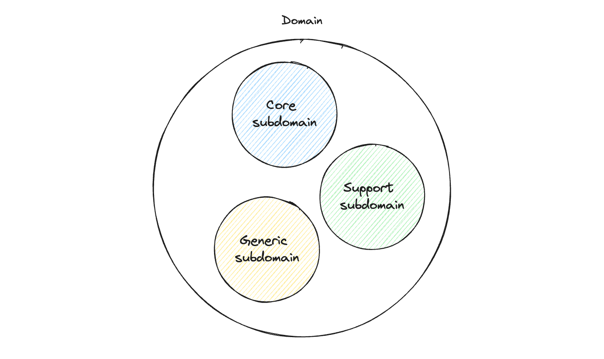
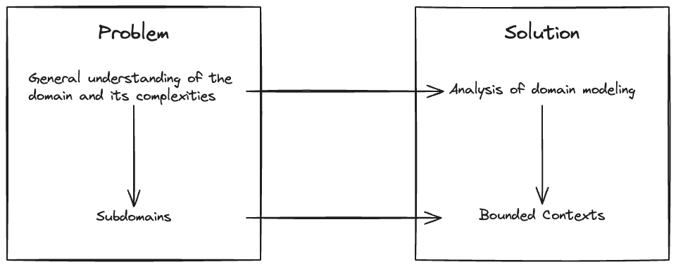
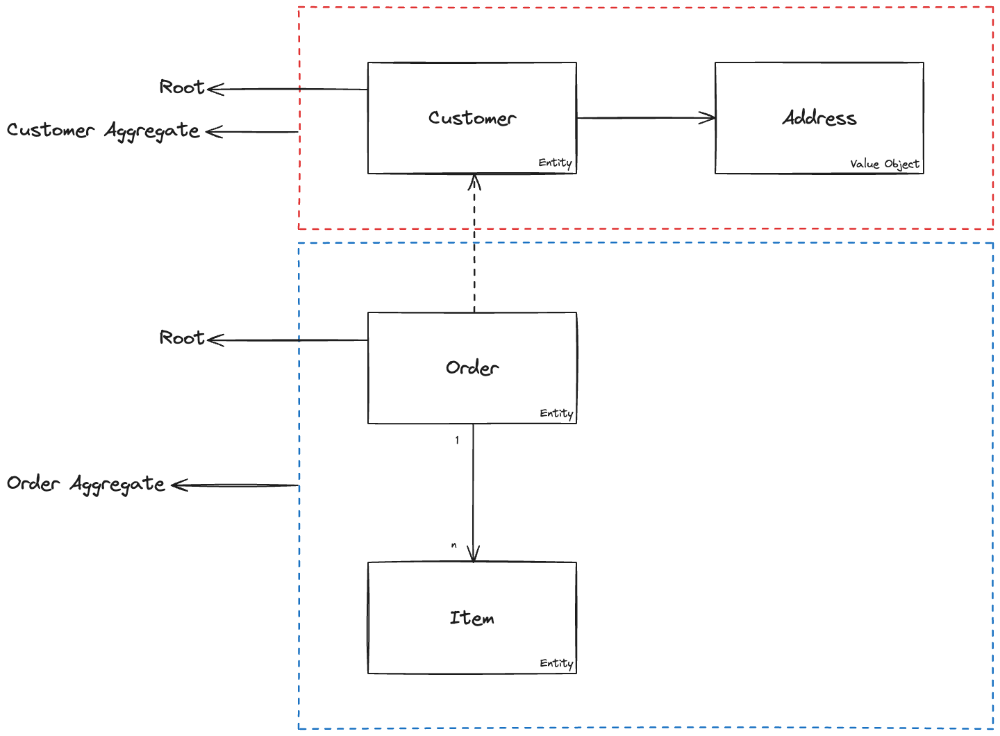

# Domain Drive Design

Domain-Driven Design (DDD) was created by Eric Evans in his book [Domain-Driven Design: Tackling Complexity in the Heart of Software](https://www.amazon.com.br/Domain-Driven-Design-Tackling-Complexity-Software/dp/0321125215). It is a collection of principles and patterns that help developers craft elegant object systems. It is neither a framework nor a library; instead, it comprises a set of principles and patterns that can be implemented in any software project. It serves as a mindset for approaching software development based on its domain, rather than its technical implementation details.

Developers must recognize that software is dynamic, influenced by people in distinct contexts, and advanced techniques are essential for navigating high-complexity scenarios successfully. DDD is vital for complex software projects where traditional off-the-shelf solutions fall short, it becomes specially important when attempting to unravel complex interrelationships within large projects involving numerous stakeholders who may speak different "languages". The complexity in such projects primarily comes from business logic rather than technological challenges and DDD provides a valuable toolkit for developers to have a deep understanding of business domains and enabling effective communication, context separation, and overall clarity in software development.

In short, DDD is primarily about modeling a ubiquitous language within a bounded context. It is a way of thinking about software development that focuses on the business domain and the language used to describe it.

## Domain vs Subdomains

In DDD, a domain encompasses the entire business or organization that the software serves, while a subdomain represents a specific, focused area within that larger domain. Subdomains are typically organized in the following hierarchical structure:

At the apex of this hierarchy is the **Core subdomain**, which constitutes the most crucial and value-driven aspect of the business or organization. To illustrate, in the case of Netflix, the Core subdomain would be the one associated with movies, as it is pivotal to the streaming service's essence. Supporting the Core subdomain are **Support subdomains**, which provide assistance to the functionality of the core area. Finally, **Generic subdomains** offer broad, cross-cutting support across the entire domain, contributing to the overall robustness and coherence of the software system.

This hierarchical organization of domains and subdomains in DDD allows for a nuanced and structured approach to software development, emphasizing the identification and prioritization of essential business components.

## Problem Space vs Solution Space

In summary, DDD involves understanding and addressing complex problems by distinguishing between the problem space and the solution space. The process begins with comprehending the overarching domain complexities and breaking them down into subdomains within the problem space. This division allows for a focused approach to solving specific issues. In the solution space, DDD emphasizes domain modeling, where the goal is to model the domain and define bounded contexts, representing specific problem areas that need resolution. The key idea is to organize and prioritize tasks within these contexts, enabling a systematic and effective development approach. DDD encourages the delineation of subdomains into bounded contexts, facilitating a comprehensive understanding of problems and their solutions, ultimately guiding software development at its core.

## Bounded Context

A bounded context is an explicit boundary within which a domain model exists. Inside the boundary all terms, definitions, and concepts of the Ubiquitous Language are consistent and specific to the domain model. This boundary not only serves as a container for the domain's intricacies but also functions as a robust framework that safeguards the precision and clarity of the shared language, facilitating effective communication and understanding among stakeholders.

The Context always reigns supreme. This implies that when encountering the same term in two distinct contexts, they constitute disparate terms, resulting in two distinct entities within your system. Conversely, if you encounter two distinct terms signifying the same concept, it is likely indicative of either a different context or a deficiency in your Ubiquitous Language.

## Context mapping

Context mapping is a collaborative technique that involves all stakeholders, including developers, domain experts, and business analysts, that helps identify the relationships between bounded contexts. It is a powerful tool that allows developers to understand the interdependencies between contexts and the overall domain and is a crucial step in the DDD process, as it enables the identification of the most critical contexts and their relationships, facilitating the prioritization of tasks and the overall development process.

### Patterns

- Partnership
- Shared Kernel
- Customer-Supplier
- Conformist
- Anticorruption Layer
- Open Host Service
- Published Language
- Separate Ways
- Big Ball of Mud

For more information about the **Context Mapping Patterns**, please refer to this [GitHub repository](https://github.com/ddd-crew/context-mapping) where you can find a detailed explanation of each one of them.

## Entities

An entity is something unique that can be changed over time. It has continuity in its lifecycle and can be distinguished independently of the attributes that are important to the user application. It can be a person, city, car, a lottery ticket, or a bank transaction, for example.

### Rich vs Anemic entities

In DDD, entities can be classified as either rich or anemic. A rich entity is one that contains both data and behavior, while an anemic entity is one that contains only data. The distinction between the two is crucial, as it has a significant impact on the overall design and architecture of the software system.

## Value Objects

An object that represents a descriptive aspect of the domain with no conceptual identity is called a Value Object. Value Objects are instantiated to represent elements of the design that we care about only for what they are, not who or which they are. Value objects are different from entities - they don't have a concept of identity. They encapsulate primitive types in the domain and solve primitive obsession.

There are three main qualities of Value Objects:

- They validate themselves
- They are immutable
- They have no identity

## Aggregates

An aggregate is a cluster of associated objects that are treated as a unit for data changes. Each aggregate has a root and a boundary. The root is an entity that serves as a single entry point to the aggregate, and the boundary is a set of rules that define the consistency of the aggregate. The aggregate root is the only member of the aggregate that outside objects are allowed to hold references to, and it is the only member of the aggregate that can hold references to other objects.

## Domain Services

A Service in the domain layer is a stateless operation that fulfills a domain-specific task. Often the best indication that you should create a Service in the domain model is when the operation you need to perform feels out of place as a method on an Aggregate or a Value Object.

If you find yourself needing to create a lot of Domain Services, it might be a sign that you need to revisit your Aggregates and Value Objects to make sure they are well designed.

## Repositories

A Repository is a mechanism for encapsulating storage, retrieval, and search behavior which emulates a collection of objects. When you retrieve an object from a Repository, you expect it to be in the same valid state as when you stored it. Generally speaking, there is a one-to-one relationship between an aggregate and a repository.

This pattern is a way to provide a separation between the domain model and the database.

## Domain Events

Domain Events are a pattern that is used to capture a state change in the domain. They are used to communicate between Aggregates and Bounded Contexts and decouple the domain model from the rest of the system.

As a good practice, we should always name the events in the past tense, as they represent something that has already happened. E.g. `OrderPlaced`, `OrderShipped`, `OrderDelivered`.

### Components

- Event: Represents something that has happened in the domain.
- Event Handler: Listens for events and performs some action in response to them.
- Event Dispatcher: Dispatches events to their handlers.
