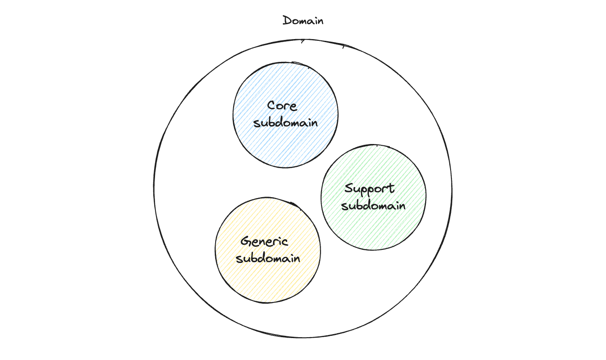

# Domain Drive Design

Domain-Driven Design (DDD) was created by Eric Evans in his book [Domain-Driven Design: Tackling Complexity in the Heart of Software](https://www.amazon.com.br/Domain-Driven-Design-Tackling-Complexity-Software/dp/0321125215). It is a collection of principles and patterns that help developers craft elegant object systems. It is neither a framework nor a library; instead, it comprises a set of principles and patterns that can be implemented in any software project. It serves as a mindset for approaching software development based on its domain, rather than its technical implementation details.

Developers must recognize that software is dynamic, influenced by people in distinct contexts, and advanced techniques are essential for navigating high-complexity scenarios successfully. DDD is vital for complex software projects where traditional off-the-shelf solutions fall short, it becomes specially important when attempting to unravel complex interrelationships within large projects involving numerous stakeholders who may speak different "languages". The complexity in such projects primarily comes from business logic rather than technological challenges and DDD provides a valuable toolkit for developers to have a deep understanding of business domains and enabling effective communication, context separation, and overall clarity in software development.

In short, DDD is primarily about modeling a ubiquitous language within a bounded context. It is a way of thinking about software development that focuses on the business domain and the language used to describe it.

## Domain vs Subdomains

In DDD, a domain encompasses the entire business or organization that the software serves, while a subdomain represents a specific, focused area within that larger domain. Subdomains are typically organized in the following hierarchical structure:

At the apex of this hierarchy is the **Core subdomain**, which constitutes the most crucial and value-driven aspect of the business or organization. To illustrate, in the case of Netflix, the Core subdomain would be the one associated with movies, as it is pivotal to the streaming service's essence. Supporting the Core subdomain are **Support subdomains**, which provide assistance to the functionality of the core area. Finally, **Generic subdomains** offer broad, cross-cutting support across the entire domain, contributing to the overall robustness and coherence of the software system.

This hierarchical organization of domains and subdomains in DDD allows for a nuanced and structured approach to software development, emphasizing the identification and prioritization of essential business components.

